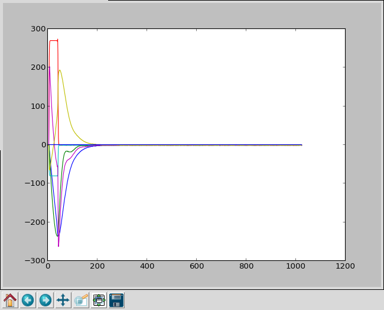
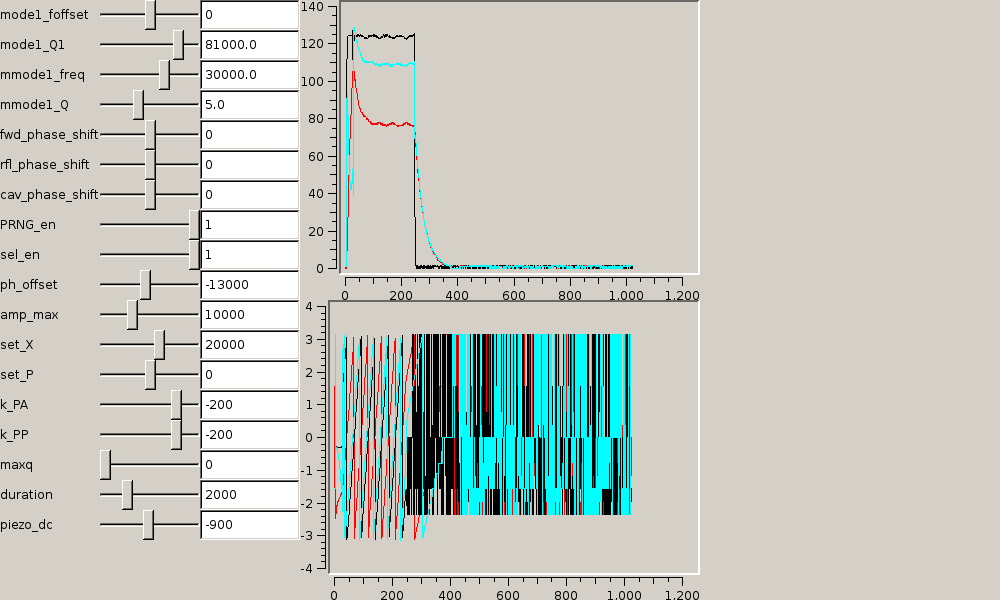
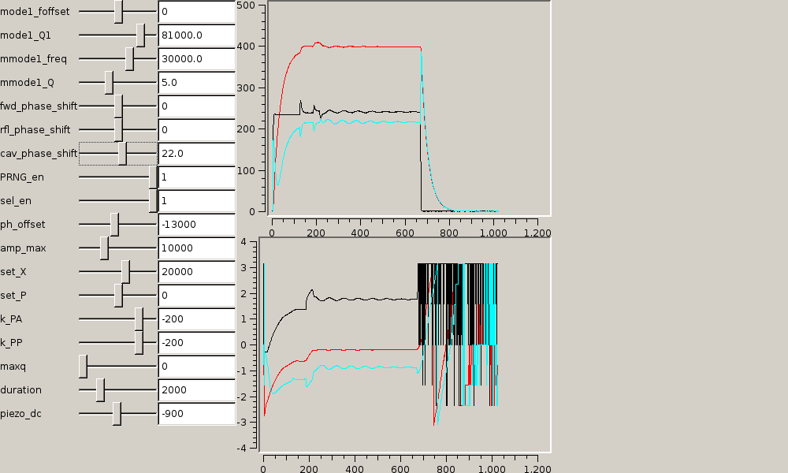

# Runtime support files for CMOC

This document includes commands you should cut-and-paste into an interactive bash shell.

## Step 1

```bash
# select board IP address as configured with ip = in synthesis directory
export IP_ADDR=fpga.ip.addr
ping $IP_ADDR
```

If this doesn't work, you need to fix something before you go on.
Attach the Ethernet cable?  Load the right bit file?  Double-check the IP address?

## Step 2

```bash
export IP_ADDR=fpga.ip.addr
python paramhg.py > larger_in.dat
python eth_test.py slow
```

And the last step should provide something like

```nohighlight
DSP flavor: 7
build date: 2015-05-05
build time: 20:54 UTC
tool rev:   14.7
user:       1 (ldoolitt)
board type: 17 (ac701)
git commit: 8e6212161fdbf1bc9a39d222a633e734d6fa57f1
circle_aw:    13
mode_count:   3
mode_shift:   9
n_mech_modes: 7
df_scale:     9
simple_demo:  0
[47744, 32768] [-5328, 5316, -4520, 4508, -5120, 5124] 0 0 6149016703032
not a plot 1
[47802, 32768] [-5324, 5316, -4516, 4512, -5124, 5128] 0 0 6149020622904
not a plot 2
[47861, 32768] [-5320, 5324, -4520, 4504, -5120, 5128] 0 0 6149024610360
not a plot 3
[47919, 32768] [-5324, 5324, -4516, 4512, -5120, 5124] 0 0 6149028530232
not a plot 4
[47977, 32768] [-5328, 5308, -4520, 4508, -5120, 5128] 0 0 6149032450104
not a plot 5
[48035, 32768] [-5328, 5308, -4516, 4508, -5120, 5128] 0 0 6149036369976
not a plot 6
[48093, 32768] [-5324, 5316, -4516, 4508, -5124, 5136] 0 0 6149040289848
not a plot 7
[48151, 32768] [-5320, 5320, -4520, 4508, -5124, 5128] 0 0 6149044209720
not a plot 8
[48210, 32768] [-5328, 5312, -4524, 4508, -5124, 5132] 0 0 6149048197176
not a plot 9
[48268, 32768] [-5328, 5316, -4516, 4508, -5124, 5120] 0 0 6149052117048
not a plot 10
```

except of course all the numbers will be different.
The last column is a full-resolution clock cycle counter.

```bash
python eth_test.py plot
```

will bring up a simple matplotlib graph of the real and imaginary waveforms.



Control-C to quit (kind of ugly).

## Step 3

The next demo involves Qt4 and posix-ipc.  You will need two terminal sessions.
In the first,

```bash
export IP_ADDR=fpga.ip.addr
rm -f /dev/mqueue/{Exit_Up,Write_Down} /dev/shm/{Up,Down,Aux}; python qgui1.py
```

which should pull up a plot like this, although rapidly moving.



Black: forward; Cyan: reverse; Red: cavity field.  Top pane is amplitude, bottom
pane is phase.

In a second session,

```bash
python script2.py
```

This will take about 10 seconds to tune up the cavity and establish closed
loop (amplitude and phase) operation, as shown here



Example transcript of the process:

```nohighlight
Coarse-tune with SEL off
Piezo set 1000
found end of pulse at 246?
starting trailing waveform analysis at 250
Measured bandwidth 8.207 kHz, detune -12.932 kHz, max amp 131.6
Piezo set 800
Measured bandwidth 8.205 kHz, detune -12.915 kHz, max amp 131.5
Piezo set 600
Measured bandwidth 8.185 kHz, detune -7.717 kHz, max amp 156.8
Piezo set 400
Measured bandwidth 8.119 kHz, detune -5.256 kHz, max amp 171.2
Piezo set 200
Measured bandwidth 8.038 kHz, detune -2.805 kHz, max amp 187.8
Piezo set 0
Measured bandwidth 7.969 kHz, detune -0.395 kHz, max amp 202.7
found cavity phase -162.4 degrees, guess register ph_offset should be 12821
Switching to SEL with ph_offset 12821
Ramping up field
Level set 10000
Measured amplitude 184.6
Level set 12000
Measured amplitude 220.7
Level set 14000
Measured amplitude 220.7
Level set 16000
Measured amplitude 290.4
Level set 18000
Measured amplitude 323.3
Level set 18930
Measured amplitude 338.5
Fine-adjust SEL phase offset
Phase delta set -17472 degrees
Measured amplitude 250.9
Phase delta set -11648 degrees
Measured amplitude 281.7
Phase delta set -5824 degrees
Measured amplitude 312.4
Phase delta set 0 degrees
Measured amplitude 338.4
Phase delta set 5824 degrees
Measured amplitude 360.5
Phase delta set 11648 degrees
Measured amplitude 380.1
Phase delta set 17472 degrees
Measured amplitude 392.9
Phase delta set 23296 degrees
Measured amplitude 399.9
Phase delta set 29120 degrees
Measured amplitude 401.0
Shifting ph_offset by 42.94 degrees, anticipated value 403.3
Measured amplitude 400.1
Fine-adjusting field
Level set 19016
Measured amplitude 401.9
Fine-tune cavity with SEL on
Measured bandwidth 8.012 kHz, detune -1.964 kHz, max amp 403.0
Piezo set -200
Measured bandwidth 8.045 kHz, detune -10.142 kHz, max amp 402.3
Piezo set -300
Measured bandwidth 8.002 kHz, detune -8.944 kHz, max amp 402.1
Piezo set -400
Measured bandwidth 8.006 kHz, detune -8.944 kHz, max amp 402.2
Piezo set -500
Measured bandwidth 8.051 kHz, detune -6.578 kHz, max amp 400.5
Piezo set -600
Measured bandwidth 8.066 kHz, detune -5.382 kHz, max amp 399.1
Piezo set -700
Measured bandwidth 8.013 kHz, detune -4.171 kHz, max amp 398.3
Piezo set -800
Measured bandwidth 7.984 kHz, detune -2.944 kHz, max amp 398.0
Piezo set -900
Measured bandwidth 8.032 kHz, detune -1.739 kHz, max amp 397.6
Piezo set -1000
Measured bandwidth 8.082 kHz, detune -0.528 kHz, max amp 396.4
Piezo set -1100
Measured bandwidth 8.046 kHz, detune 0.679 kHz, max amp 394.8
Piezo set -1075
Measured bandwidth 8.060 kHz, detune 0.374 kHz, max amp 395.3
Piezo set -1050
Measured bandwidth 8.064 kHz, detune 0.383 kHz, max amp 395.1
Piezo set -1025
Measured bandwidth 8.078 kHz, detune -0.229 kHz, max amp 396.0
Piezo set -1031
Measured bandwidth 8.089 kHz, detune -0.152 kHz, max amp 395.8
Piezo set -1037
Measured bandwidth 8.084 kHz, detune -0.080 kHz, max amp 395.9
Stretching pulse
Pulse length set 16000
Pulse length set 18000
Pulse length set 20000
Pulse length set 22000
Pulse length set 24000
Pulse length set 26000
Pulse length set 28000
Pulse length set 30000
Pulse length set 32000
Pulse length set 34000
Pulse length set 36000
Pulse length set 38000
Pulse length set 40000
Pulse length set 42000
Opening up control span
Fine-tune cavity with SEL on
Measured bandwidth -0.002 kHz, detune -0.503 kHz, max amp 401.4
Piezo set -1043
Measured bandwidth -0.007 kHz, detune -0.520 kHz, max amp 401.4
Piezo set -1143
Measured bandwidth -0.001 kHz, detune 0.646 kHz, max amp 400.6
Piezo set -1118
Measured bandwidth 0.001 kHz, detune 0.638 kHz, max amp 400.6
Piezo set -1093
Measured bandwidth -0.003 kHz, detune 0.062 kHz, max amp 400.8
Closing phase loop
```

Note that the code running the above test is missing some long-term essential
features, like updating the sliders when the script runs.  All the
configuration results from running the script are therefore lost if you move
any of qgui1's sliders afterwards.
